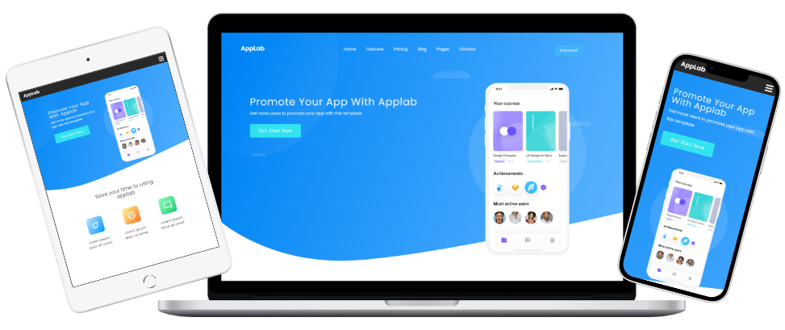

# Responsive Landing Page

 

*Graphic template is from [Colorlib](https://colorlib.com/wp/)*

&nbsp;

 ## :bulb: The goal of my work was:
- code **Responsive Web Design (RWD)** site 
- make it looks good on every screen - **mobiles, tablets and desktops** 
- use pure **HTML** and **CSS**
- use **BEM** methodology

&nbsp;

## :envelope_with_arrow: Feel free to contact me
The project was coded by Anna Królikowska

Find me on [**LINKEDIN**](https://www.linkedin.com/in/krolikowska-ann/) or [**GitHub**](https://github.com/annakrolikowska)
